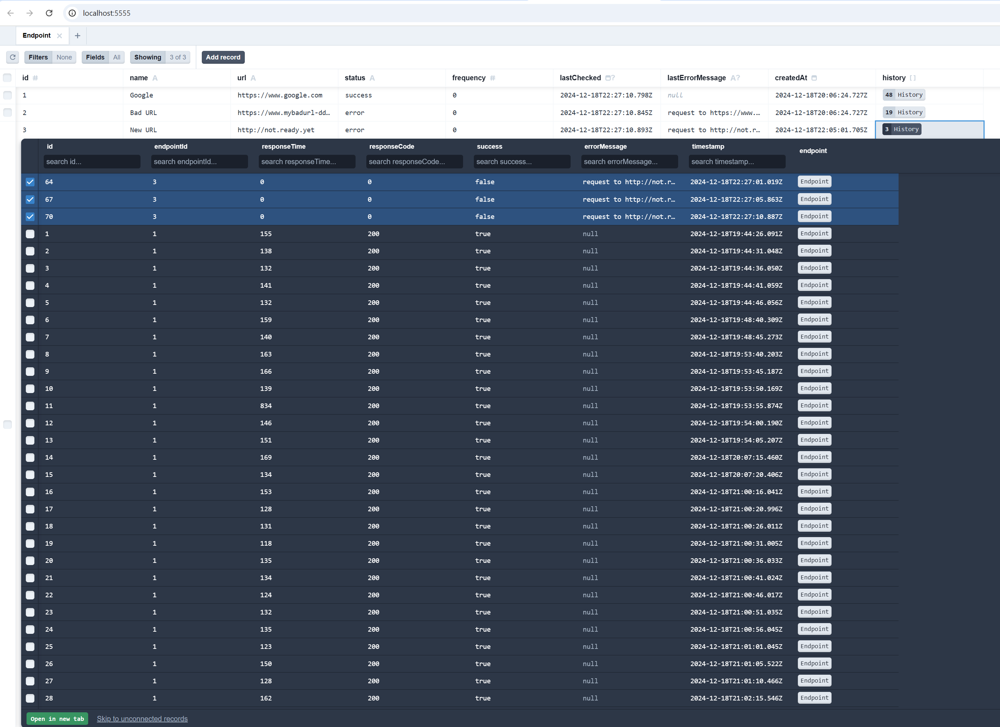
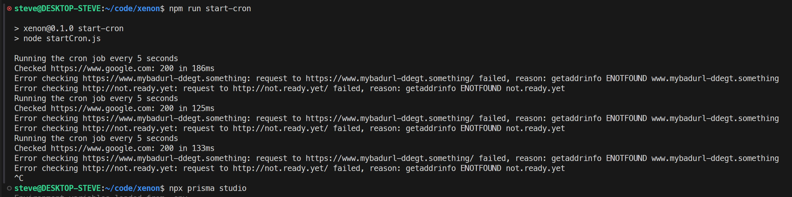
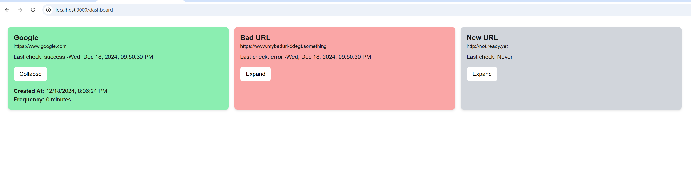

# Xenon

Exampe next.js application for monitoring API endpoints for uptime and performance.

## Create endpoints to monitor

To open prisma studio:

```bash
npx prisma studio
```

Add some endpoints. Currently frequency is hard-coded to every 5 seconds. All you need is a name and a url.



## Start monitoring to collect some data

To start the monitoring cron:

```bash
npm run cron-start
```



stop with CTRL-C

## View the dashboard

To run the development server:

```bash
npm run dev
```

Open [http://localhost:3000/dashboard](http://localhost:3000/dashboard) with your browser to see the dashboard.


